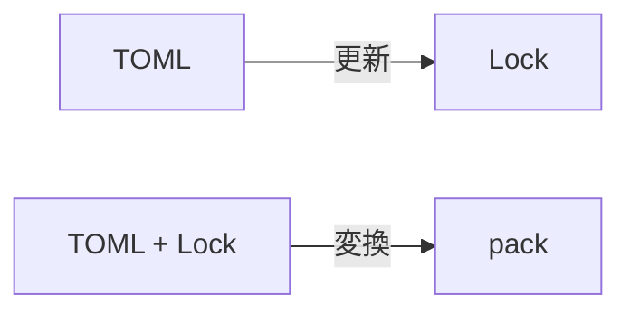

:::message

この記事は[Vim駅伝](https://vim-jp.org/ekiden/)の2025-12-29の記事です。
Vim駅伝は常に参加者を募集しています。詳しくは[こちらのページ](https://vim-jp.org/ekiden/about/)をご覧ください。

:::

ずっとNeovimのプラグインマネージャを自作したいなと思っていました。

# おことわり

本記事は技術記事というよりもエッセイに近い内容です。

# なぜ自作

第一に**プラグインマネージャ自体がプラグインとして動作していることがしっくり来なかった**からです。多くのプラグインマネージャはVimのプラグインマネージャとして動作していますが、インストール・アップデート後に `plugin/` のスクリプトなどの再読み込みが必要になるプラグインも少なくないため、現実的にインストール/アップデート後にVim再起動は必要になると思っています。そうなると、**アップデートのためだけにVimを立ち上げコマンドを叩く**作業が発生することになります。この点を踏まえ、Vimプラグインではない別バイナリにすることが自然になるかなという考えに至りました。

第二に、**インストール/アップデートを速く行いたかった**ためです。大抵のVimプラグインはGitプロトコルを用いていますが、clone/fetch の深度1でかつ並行して行うようなマネージャがほとんどを占めている、というわけではなさそうでした(調査不足かもしれません)。

第三に、**成果物となるファイル配置をポータブルかつ決定的にしたいと考えた**からです。私は Nix のユーザーで、自分の環境を宣言的に管理しています。Vimの環境もNixで管理を行いたいのですが、以下の点で相性が良くないと感じました。

1. 頻繁にアップデートされるため、ハッシュ値を管理するのが面倒。
2. プラグインのダウンロード場所、遅延実行のスクリプトが散らかる。
3. Nixに持ち込むにはそこそこ煩雑。

将来的にはNixで設定したいが、その際に「(入力)TOMLファイル群 & Lockファイル → (出力)packディレクトリ」のビルドツールとして用いることができるようなものが欲しいと考えました。

他に細かなものとしては以下のようなものがあります。

- 同時に読み込まれるようなプラグインをマージしたい (runtimepathを減らしたい)
- プラグイン設定なしの設定スクリプトのみの設定を依存関係に組み込みたい

これらの不満は、1つや2つ部分的に解決しているプラグインマネージャはありますが、全てを満たすものがなさそうだったため、自作するのが良いのかな、と考えるようになりました。

# 欲しいもの

- Gitプロトコルで深度1かつ並行してインストール/アップデート
- TOMLファイル & Lockファイルを入力し、1つの[package](https://vim-jp.org/vimdoc-ja/repeat.html#packages)を出力する
- Lockファイルの更新を管理する

## 設計

### おおまかな動作(案)

後者2つについては、Nixでの管理に組み込みやすいことを念頭に置いた設計がしたいと思っていますが、以下のどちらのパターンで実装するのが良いのか悩んでいます。

**案1**： LockファイルにTOMLの情報も含めてしまい、packディレクトリの生成にはLockのみに依存させるパターン。

**案2**： Lockファイルにはハッシュ値のみ保存し、packディレクトリの生成にTOMLとLockの両方を用いるようにするパターン。

### 使う言語

使う言語は以下を選定しました。怒られそうですが選定に際してあまり考えておらず、自分が開発してて楽しいものという動機が最も大きいです。

- Rust
  - Luaスクリプトのテンプレートエンジンは [sailfish](https://github.com/rust-sailfish/sailfish) を使います。
- Lua
  - 私がNeovimを使っているためです

### 遅延読み込みについて

遅延読み込みを実現するには以下の要素が必要になります。

- イベントから
  - ランタイムパスの追加、`plugin/`, `ftdetect/` などのスクリプトの読み込み
  - `:packadd` の実行でできそう
- プラグイン関連スクリプトの読み込み
  - `setup` の読み込みなどをするアレ

これらを管理する設計として、`PlugCtl` という構造体に全てのプラグイン設定を読み込ませ、全ての設定スクリプト・他プラグインを読み込むイベント設定をした1つのプラグインに変換してpackディレクトリの出力に組み込む形式としました。

# 今の進捗

こちらです。

https://github.com/gw31415/rsplug.nvim

## 現状

- [x] TOMLの読み込み
- [x] 並行したインストール/アップデート
- [ ] Lockファイルの読み込み/書き出し
- [ ] プラグインなし・設定スクリプトのみの設定のサポート

- 関連スクリプトの読み込み
  - [x] `lua_after`: プラグイン読み込み後に実行するLuaスクリプト
  - [x] `lua_before`: プラグイン読み込み前に実行するLuaスクリプト
  - [ ] `lua_start`: Neovim起動直後に実行するLuaスクリプト
  - [x] `build`: インストール後に起動するサブプロセス

- 遅延読み込み
  - [x] `on_event`: autocmd イベントでの遅延読み込み
  - [x] `on_ft`: ファイルタイプでの遅延読み込み
  - [x] `require` 時に自動読み込み
  - [x] `on_cmd`: 特定コマンド実行時の遅延読み込み
  - [ ] `on_map`: キーマッピング実行時の遅延読み込み

# Contribute 募集

現在、手探りで開発を進めており、自身の利用という点では最低限の機能は揃えられた段階ですが、足りない or 不完全な機能実装がまだまだあります。特に以下が致命的です。

- `on_map` の実装が壊れている
- `start` ではない、 `sym` or `build` の設定をしたプラグインのHelpが生成されない
- TUI出力が重い気がする
- 依存関係のツリーが兄弟関係にあるプラグインがマージされるが、これらの順序を規定してマージを避ける仕組みがない

他にも [Issue](https://github.com/gw31415/rsplug.nvim/issues) に色々と課題を書き出しています。
もし、Contributeして下さる方がいらっしゃいましたら、大変助かります。IssueやPull Requestをお待ちしております。

# 本記事に関する指摘募集

**本記事中の間違いの指摘を募集しています**。というのも、私はこのツールを作るにあたってのそもそもの動機に自信がありません。**「プラグインマネージャ自体がプラグインとして動作」しているのが果たして不自然と言えるのか**という点には特に自信がありません。なぜなら、このアイデアが正しければ、別バイナリになっていないプラグインマネージャがメジャーな昨今、私と同じような消化不良を起こしている開発者が多いはずなので、**そもそも現在別バイナリになっているプラグインマネージャが少ないのはなぜなのか**、という疑問が生じるからです。もし的を得ていない記述があれば、指摘していただければ早期に開発の方針転換または撤退することができるため、大変助かります。

# 最後に

空き時間にざっと書き下させていただきました。文章として構成が整っていない駄文ではありますが、ここまで読んでくださりありがとうございました。

