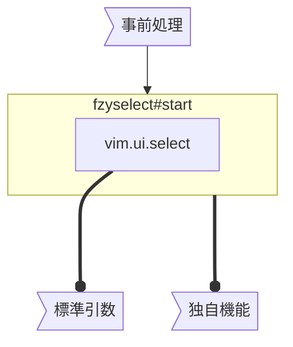

こんにちは！皆さんはVimのマルチバッファ機能は使っていますか？今回は、Neovimのバッファをファジーファインダで管理するプラグインを作ったので、その紹介をします。

# VimのBuffer機能

Neovimには、バッファを管理するためのコマンドがいくつか用意されています。例えば、`:ls` でバッファ一覧を表示したり、`:b`コマンドでバッファを切り替えたりできます。これらのコマンドは大変シンプルで、バッファが少ないうちは使えると思います。

しかし、大規模なプロジェクトの開発をしていると**バッファは増えてしまうもの**です。気付いたらバッファが数十個になっていた、なんてザラですよね。Vim以外のエディタを使ったことがある人なら**タブ機能**がよく使われると思いますが、Vimにおいては**バッファ機能**がメジャーです。**タブよりもUIが煩雑にならないシンプルな仕組み**で、個人的には気にいっていますが、

- 一覧されることがなく、自然にバッファが増えていく
- 切り替えや整理にIDを覚える必要がある

といった使いにくさが残っています。

「残っています」と言ったのは、そもそもバッファの仕組みはタブに比べて、**ユーザー寄りというよりは設定でプログラムしやすい**方に寄っているものだからです。他のVim標準機能と同様、そもそも設定で各ユーザーが使いやすい仕組みにしやすいことが強みです。

# 既存のプラグイン

整理しやすくするための既存のプラグインも以下のように沢山あります。今回作成したプラグインはこういったものの1つということになります。

https://github.com/zefei/vim-wintabs

https://github.com/akinsho/bufferline.nvim

https://github.com/j-morano/buffer_manager.nvim

https://github.com/romgrk/barbar.nvim

これらではなく、今回新規に作成した理由です↓

- 自分が普段使っているファジーファインダ [`gw31415/fzyselect.vim`](https://github.com/gw31415/fzyselect.vim) を使いたかった
  - `telescope.nvim` は入れたくない
- バッファを削除するオペレータが欲しかった
- 別にタブのような表示をしたい訳ではない

上記の [`gw31415/fzyselect.vim`](https://github.com/gw31415/fzyselect.vim) については、[以前にも記事を書いています](https://zenn.dev/vim_jp/articles/fzyselect-vim-introduction)ので、興味があればご覧ください。

# 実装

## 実装したこと/しなかったこと

今回実装したのは以下の通りです。基本的な機能ですね。

- バッファの一覧表示
- バッファを選択して開く
- バッファを削除するオペレータ

一方、以下の機能や設計では実装していません。

- ファジーファインダを入れ替え可能な設計
  - 自身が普段使っていないファジーファインダのAPIを知らないため
  - `vim.ui.select` のAPIのみでの実装ができなかったため、自身で `fzyselect` のAPIを拡張して作っています
- バッファのグループ化
  - 自身はバッファ管理の基本機能のみで十分なため
- タブのような表示
  - 自身が必要としていないため

## 実装内容

プラグイン本体はこちらです↓

https://github.com/gw31415/bufmanager.nvim

`fzyselect#start` の引数は基本的に `vim.ui.select` のスーパーセットとして作っています。頭の整理のために、実装に必要な機能を以下のように分けましょう。

- `vim.ui.select` でできる機能
  - 呼び出し前に**事前処理**する
  - **標準引数**で指定する
- `vim.ui.select` でできない機能
  - **独自機能**で実装する

### 事前処理

まず、 `fzyselect#start` を呼び出す前にできることをリストアップします。

- 操作するウィンドウのIDを取得する
- バッファの一覧を取得する
  - バッファリストを並べ替える

`bufmanager#open` を呼び出す部分の実装は以下のようになっているのですが、44-46行目でこれらの処理をしています。

https://github.com/gw31415/bufmanager.nvim/blob/c0295d5/autoload/bufmanager.vim#L43-L53

### 標準引数で指定する内容

先ほどのコードの49-52行目で、`fzyselect#start` に渡す引数を指定しています。

https://github.com/gw31415/bufmanager.nvim/blob/c0295d5/autoload/bufmanager.vim#L49-L52

これらは、`vim.ui.select` の引数とほぼ同じで、 **`bufnr` から表示する行へのフォーマット**、**バッファ選択後のバッファ移動コールバック**を指定しています。

- 第一引数
  - `s:bufs`: 事前処理でフィルター&ソートした `bufnr` のリスト
- 第二引数
  - `format_item`: `bufnr` から表示する行へのフォーマット
  - (`prompt`: `fzyselect` 独自; 今回は無視してください)
- 第三引数
  - バッファ選択後のバッファ移動コールバック

### 独自機能でしかできないこと

最後に、`vim.ui.select` で実現できなかった機能について説明します。

残った機能は**バッファの削除**ですが、これは `vim.ui.select` には用意されていない以下の機能がファジーファインダー側に必要になります。

- **UI表示中のアイテム取得**
- **UI表示中のアイテム更新**

削除用オペレータを実装する際、各行に何のアイテムがあるか逆引きする必要があります。また、バッファ一覧がUIを閉じる前に変更されますが、この時に更新が必要になります。これらは一般的な `vim.ui.select` には用意されていないため、ファジーファインダー毎に実装を変更する必要があります。

`fzyselect` においては、これらはそれぞれ `fzyselect#getitem` および `fzyselect#refresh` という関数で用意しています。

オペレータの実装は以下の通りです。

https://github.com/gw31415/bufmanager.nvim/blob/c0295d5/autoload/bufmanager.vim#L18-L30

そして、オペレータを `fzyselect` バッファが開いた `autocmd` で設定することで実現しているわけです。

https://github.com/gw31415/bufmanager.nvim/blob/c0295d5/autoload/bufmanager.vim#L47-L48

# 最後に

今回は自分の需要に合わせてバッファ管理プラグインを作成しましたが、よかったら今回の記事の内容を元にあなたオリジナルのバッファ管理機能を作成してみてください。オペレータの作成部分や、`vim.ui.select`の部分、バッファ管理周辺のNeovim APIは流用しやすいと思います。Vimの良いところは自分の好みに合わせてカスタマイズできるところですからね。
