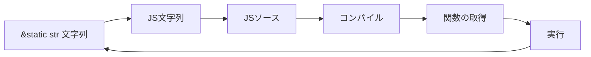
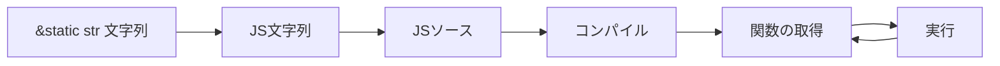

今回は、MathJaxを呼び出すJavaScriptをRustから呼びだすことを目指します。

# 背景

理系コミュニティのSNSでは、数式の画像化Botに対して一定の需要があり、駆け出し個人開発者がまず始めに制作する機能の1つです。しかし、数式の画像化に役立つ技術的環境は少ないです。まして、プログラムから呼び出せるような磐石なAPIやライブラリは限られています。

:::message
例えば、TeXは実質的にスクリプト言語のため、任意コード実行されるような脆弱性があります^[[SECCON Beginners CTF 2022 Writeup](https://gaato.net/blog/ctf/ctf4b2022/)]。安全な実装のためにはコンテナを用意するなど、コストが高くなる傾向があります。
:::

Node.jsには[MathJax](https://www.mathjax.org)という数式レンダリング用ライブラリがあります。これはサーバーサイドまたはブラウザサイドでTeXライクな数式表現を様々な形式にレンダリングするためのJavaScriptライブラリで、アメリカ数学会によってメンテナンスされています。メンテナンスの継続性や堅牢性のためにはほぼ唯一といっていい選択肢だと思います。

しかし、MathJaxを使用するとなると開発言語としてJavaScriptを選択せざるを得なくなります。異環境へのデータ転送処理のコスト等を考えると^[[Node.js と Deno と Bun のどれを使えばいいのか](https://qiita.com/access3151fq/items/2466126b612fad1c084a#前提4速度の劇的な差は無い)]このように全てNode.jsで完結するのがベストかもしれませんが、「Node.js以外でもMathJaxを使いたい！」というのは割と妥当性のある動機だと思います。

# 設計

## やること

- [`v8`](https://crates.io/crates/v8)(旧`rusty_v8`)クレートを用いる
  - Denoコミュニティが主たる開発に携っており、信頼も保守の観点からも安心できます。スクリプト実行前にJITコンパイルを行うため、複数回レンダリングする際に工夫ができます(後述)。

## やらないこと

- 実行時の動的インポート処理
  - 今回は実行内容が固定のため事前にバンドルする形にしました。インポート先の実行時解決をする必要がなくなります。

## できなかったこと

- 他の`v8`依存クレートとの競合の解消
  - `v8`クレートの初期化の関係上、他の`v8`依存クレートと共存することができませんでした。
- HandleScopeとContextScopeの区別
  - V8の理解の話になりますが、両者の区別について今回は理解に至りませんでした。

# 開発

## 同梱するJSモジュールを作成する

今回は実行したい処理が決まっているため、インポート文の解釈を行う代わりに単一ファイルにバンドルします。

:::message
動的にインポートしたい場合は `deno_core` クレートを用いるこちらの記事の方法が便利です。
https://zenn.dev/skanehira/articles/2022-11-20-rust-deno-node
:::

実際に用いたソースコードはこちらです。

:::details TypeScriptモジュール

```ts
// [こちらのソースコード](https://github.com/gaato/tex.gaato.net/blob/71242f0aa8e23d26848844d52fd685274f04c738/server.js) の一部を少し改変しています。
import { mathjax } from "mathjax-full/js/mathjax.js";
import { TeX } from "mathjax-full/js/input/tex.js";
import { SVG } from "mathjax-full/js/output/svg.js";
import { liteAdaptor } from "mathjax-full/js/adaptors/liteAdaptor.js";
import { RegisterHTMLHandler } from "mathjax-full/js/handlers/html.js";
import { AllPackages } from "mathjax-full/js/input/tex/AllPackages.js";
import { OptionList } from "mathjax-full/js/util/Options";

const adaptor = liteAdaptor();
RegisterHTMLHandler(adaptor);

export default function (
  latex: string,
  options: OptionList | undefined = undefined,
): string {
  try {
    const tex = new TeX({ packages: AllPackages });
    const svg = new SVG();
    const doc = mathjax.document("", { InputJax: tex, OutputJax: svg });
    const node = doc.convert(latex, options);

    const svgString = adaptor.outerHTML(node);
    const svgTag = svgString.match(/<svg[^>]*>[\s\S]*?<\/svg>/g)![0];

    // エラーがあったら取り出してスローする
    if (svgTag.includes("data-mjx-error")) {
      const errorTitle = svgTag.match(/title="([^"]+)"/)![1];
      throw new Error(errorTitle);
    }

    return svgTag;
  } catch (error: any) {
    throw new Error(`${error.message}`);
  }
}
```

:::

やっていることは単純で、MathJax表現文字列の引数`latex`をSVG文字列に変換して返すだけです。

```ts
import { OptionList } from "mathjax-full/js/util/Options";
export default function (
  latex: string,
  options: OptionList | undefined,
): string;
```

こちらのソースコードの依存関係を事前に解決するため、単一ファイルにバンドルします。今回は個人的成り行きで[Bun](https://bun.sh)を用いましたが、[esbuild](https://esbuild.github.io)や[webpack](https://webpack.js.org)を用いてもできると思います(未検証です)。

```bash
bun build --outfile=out/index.mjs --minify --target=browser src/index.ts
```

## ソースコードを同梱して実行する

前節で作成したTypeScriptモジュールは文字列として `v8` に読み込ませることができます。ファイルを文字列としてビルド時に読み込むために `include_str!` マクロを用いました。

### `v8`クレートの仕組み

`v8`ではソースコードをコンパイルして実行するために、`v8`自体の初期化、`Isolate`, `HandleScope`, `ContextScope` を用意する必要があります。

`Isolate`とは独立した環境のことで、全てのオブジェクトはこの中で完結させる必要があります。
つまり、別の`Isolate`間で変数などのやりとりはしないということです。

```rust
let mut isolate = v8::Isolate::new(Default::default());
// HandleScopeを追加するためにミュータブルにする
```

`HandleScope`や`ContextScope`は変数のスコープを表します。両者の区別については何かあるようですが今回は理解できませんでした。

```rust
let scope = &mut v8::HandleScope::new(isolate);
let context = v8::Context::new(scope);
let scope = &mut v8::ContextScope::new(scope, context);
// IsolateからHandleScopeを取得し、ContextScopeに変換する
```

`v8`では、「変数の宣言」や「変数への値の格納」など様々な操作に対して `HandleScope` 型の引数をとります。それぞれの操作がどのスコープで行われているのかに対応しているのです。

```rust
// Load js file
let code = include_str!("index.js"); // ファイルからソースコード文字列の取得
let source = v8::String::new(scope, code).unwrap(); // v8の文字列値に変換
let origin = create_origin(scope, "index.js", true);
let source = v8::script_compiler::Source::new(source, Some(&origin)); // JSのソースに型変換
let module = v8::script_compiler::compile_module(scope, source).unwrap(); // JSソースをコンパイルする

// Instantiate module
module.instantiate_module(scope, module_callback).unwrap();
module.evaluate(scope).unwrap();

// モジュールから識別子`default`のメンバを取得
let obj = module
    .get_module_namespace()
    .to_object(scope)
    .unwrap()
    .get(scope, v8::String::new(scope, "default").unwrap().into())
    .unwrap();
// objを関数に変換
let func = v8::Local::<v8::Function>::try_from(obj).unwrap();
```

こちらが公式によるサンプルです。

https://docs.rs/v8/0.81.0/v8/index.html#example

:::details 実際のコード
https://github.com/gw31415/mathjax_svg/blob/30586891018ff1ea321ac816930e1af24b15a836/src/lib.rs
:::

## コンパイル済環境を使い回す

これでも目的は達成できるのですが、これだと `convert_to_svg` を行うたびにRustの `&'static str`で保持されたJSモジュール文字列からコンパイルまでのプロセスを実行してしまうためとても遅くなります。最初の実行までにJSのコンパイルを行い、スコープを使い回すことで複数回コンパイルすることを回避します。

- 改善前



- 改善後



グローバルに保持しておくべき値は以下の2種類です。コンパイルした関数をグローバルな領域に変数として確保しておき、実行時に `Global<Context>` からスコープを生成して実行する流れになります。

- `OwnedIsolate`
- `Global<Context>`

```rust
pub fn convert_to_svg(latex: impl AsRef<str>) -> Result<String> {

    // OwnedIsolateからHandleScopeを生成する。
    let handle_scope = &mut v8::HandleScope::new(&mut ISOLATE);
    // Global<Context>からContextScopeを生成する。
    let context = v8::Local::new(handle_scope, GLOBAL_CONTEXT.clone());

    let scope = &mut v8::ContextScope::new(handle_scope, context);
    let scope = &mut v8::TryCatch::new(scope);

    let key = v8::String::new(scope, FUNC_ID).unwrap().into();
    let obj = context.global(scope).get(scope, key).unwrap();
    let func = v8::Local::<v8::Function>::try_from(obj).unwrap();
    let args = [v8::String::new(scope, latex.as_ref()).unwrap().into()];
    if let Some(result) = func.call(scope, obj, &args) {
        return Ok(result.to_rust_string_lossy(scope));
    }
    panic!("error");
}
```

### 非同期問題の回避

ところが、 `OwnedIsolate`や`Global<Context>` は `!Sync` なので、この関数はこのままでは非同期で実行することができません。このためこれらをThread-local変数にして非同期に呼び出しても問題ないようにします。

```rust
/// OwnedIsolateとGlobal<Context>の組
type InitializationResults = (UnsafeCell<OwnedIsolate>, Global<Context>);

/// thread_localで用いるための初期化値生成関数
fn initialize() -> InitializationResults {
    // 中略
}

pub fn convert_to_svg(latex: impl AsRef<str>) -> Result<String> {
    thread_local! {
        pub static ISOLATE_CONTEXT: InitializationResults = initialize();
    };
    ISOLATE_CONTEXT.with(|(isolate, context): &InitializationResults| {
        // isolate is thread-local, so you don't have to worry about Sync.
        // isolate is immediately shadowed here, so there is no need to worry about
        // another mutable/immutable reference being created later.
        let isolate: &mut OwnedIsolate = unsafe { isolate.get().as_mut().unwrap_unchecked() };

        let handle_scope = &mut v8::HandleScope::new(isolate);
        let context = v8::Local::new(handle_scope, context.clone());
        let scope = &mut v8::ContextScope::new(handle_scope, context);
        let scope = &mut v8::TryCatch::new(scope);

        let key = v8::String::new(scope, FUNC_ID).unwrap().into();
        let obj = context.global(scope).get(scope, key).unwrap();
        let func = v8::Local::<v8::Function>::try_from(obj).unwrap();
        let args = [v8::String::new(scope, latex.as_ref()).unwrap().into()];
        if let Some(result) = func.call(scope, obj, &args) {
            return Ok(result.to_rust_string_lossy(scope));
        }
        panic!("Error");
    })
}
```

## 完成

完成品は以下のリポジトリにあります。

https://github.com/gw31415/mathjax_svg

# 最後に

今回用いた手法はMathJaxのみではなく、Rust内で組み込みでJavaScriptを用いる際に汎用して使える方法となっています。他の`v8`クレートと競合したり、うまくバンドルできない/バンドルしたソースを読みこめないJavaScriptがいくつかあったりとまだ問題も残っていますが、面白いと感じていただければ嬉しいです。
